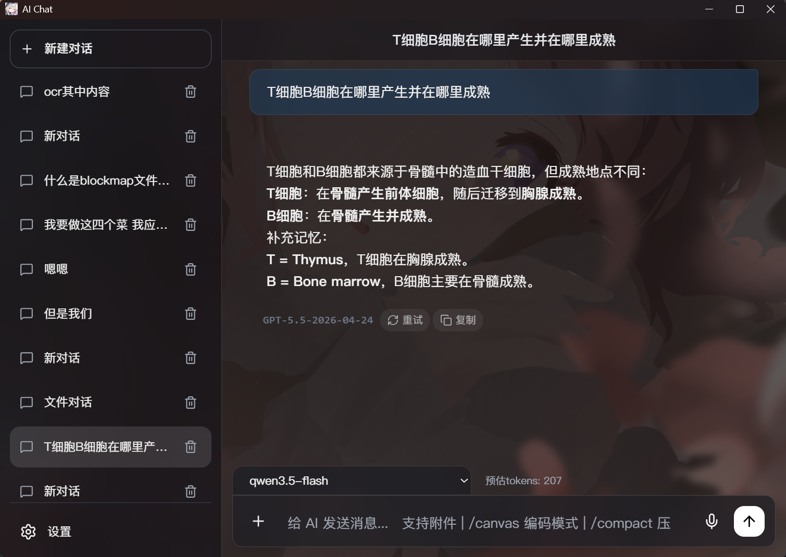
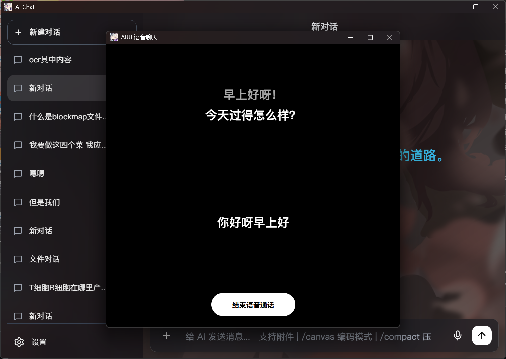

# AIChat-UI build with tauri, based on JHCWColin/AIChat-UI

Some function will NOT work properly.

---
<div align="center">




### Your Next Gen Vibe Coding Toolkit

基于前端页面与 Electron 的 AI 对话桌面应用，覆盖文字聊天、Canvas 编码、语音聊天、附件解析、图像生成与 Windows 本地打包。

[](LICENSE)
[]()

</div>

---

## 项目概览

AIUI 是一个以单页前端为核心、同时提供 Electron 桌面壳的 AI 工作台。当前版本重点覆盖以下能力：

- `/canvas` 编码模式：在对话旁直接生成和编辑代码画布。
- 多模型聊天：可配置 API Key、Base URL、模型列表和默认模型。
- 语音聊天模式：使用 Silero VAD、讯飞流式听写和 Fish Audio HTTP TTS。
- 桌面协作模式：透明置顶字幕、点击穿透、全局快捷键截图与语音上下文协作。
- 常驻系统托盘：支持新建或恢复最近会话，并可直接启动语音聊天或桌面协作。
- 语音回放：语音聊天模式生成的 AI 语音可保存并在主对话中回放。
- 附件解析：支持图片、`.docx`、`.pptx`、`.xlsx`、`.txt`、`.md` 等文件。
- 图像生成增强：支持在提示词中写入 `16:9`、`4:3`、`1:1` 等宽高比关键词。
- 上下文压缩：支持自动摘要、手动 `/compact` 和独立摘要模型。

---

## 最近更新

### V6.0.0 Release

### V6.0.0 Canary 3

- 修复桌面协作字幕向左移动后右侧文字仍被截断的问题，改用真实横向滚动并随流式文本实时刷新位置。
- AI 字幕只在开始朗读无法完整显示的当前语句时滚动，已完整显示的前置语句保持静止。
- 用户语音识别字幕持续跟随最新部分识别文字。

### V6.0.0 Canary 2

- 大图预览打开与关闭增加淡入淡出动画。
- 修复桌面协作播放 AI 语音时被 VAD 自我识别的问题；新增“跳过B组语音”设置，默认关闭。
- 桌面协作字幕改为横向自动滚动，避免用省略号隐藏完整句子。

### V6.0.0 Canary

- 新增桌面协作独立窗口，主窗口自动最小化，透明字幕停靠当前显示器底部。
- 新增可配置全局传图快捷键与截图精细度；截图在下一次语音输入时随消息发送。
- 语音聊天与桌面协作统一跟随主界面 API endpoint，支持 Responses 501 自动回退。
- 新增常驻托盘菜单、最近会话启动、开发者日志操作和关闭主窗口后继续驻留。
- 预制语音新增 C 组，截图请求会在 A 组后必定播放一条 C 组语音。

### V5.7.0 Alpha

- 修复对/chat/completions接口的回复内容渲染逻辑问题。
- 修复对/responses接口回复内容分类判定不精确的问题。
- 用户选择/responses端口若遇到501错误将自动回退/chat/completions。

### V5.6.0 Alpha 2

- 加入了KaTeX渲染的字体，显示更加精确。
- 增强密钥安全性。

### V5.6.0 Alpha

- 修复手动停止 AI 生成后，灵动岛通知仍然常驻的问题；现在会像正常回复结束一样在短暂时间后自动消失。
- 继续完善 Responses API 的流式输出兼容，已能正确返回非流式回复，并在收到增量内容时实时刷新消息内容。
- 微调设置内容的布局。

### V5.5.0 Alpha

- 回放灵动岛改为单行通知高度，只显示整段回复进度和图标控制键。
- 回放会按顺序连续播放该次 AI 回复中全部成功生成的语音句子。
- 修复清除语音记录后播放条闪现，以及首条语音播放前字幕定位到最后一句的问题。

### V5.4.0 Alpha

- 语音聊天模式生成的 AI 语音现在会保存到 IndexedDB。
- 主对话中，来自语音聊天模式的 AI 回复会显示“回放”按钮。
- 新增顶部“灵动岛”式回放条，支持暂停、停止、拖动整段回复进度和自动切换播放。
- 偏好设置“其他”新增“清除语音记录”，会通过自定义警告弹窗删除所有非预制语音记录。


完整记录见 [UPDATE.md](UPDATE.md)。

---

## 核心功能

### 1. Canvas 编码模式


- 在输入框发送 `/canvas` 后，右侧进入代码画布模式。
- 画布基于 CodeMirror，支持语法高亮、行号与手动编辑。
- AI 可通过 `[replace]` 风格的替换指令精确修改画布内容。

### 2. 语音聊天模式



- 独立 `audiochat.html` 页面，采用上下双分区字幕布局。
- 上半区显示 AI 字幕，下半区显示用户识别文本。
- AI 字幕支持按句自动跟随与逐句淡入。
- 语音聊天生成的 AI 语音可在主对话中按整次回复连续回放。
- 可在偏好设置中一键清除历史语音记录，不影响预制语音与后续新记录。
- 语音聊天可以从文字对话中途开始也可以之后转成文本继续对话。

### 3. 桌面协作模式

- 透明、无边框、始终置顶的横向字幕窗口默认停靠当前显示器底部。
- AI 与用户语音内容各占一行，白色字幕使用黑色文字阴影保证可读性。
- 除“结束对话”按钮区域外，窗口允许鼠标操作穿透到下层桌面。
- 全局传图快捷键默认是 `Ctrl+A`，截图精细度默认使用 1920px / JPEG 85。
- 多次截图只保留最后一张，并在下一次语音输入时作为用户消息附件发送。
- 结束协作后，文字、AI 语音记录和截图会写回对应主会话。


### 4. 多模型与 API 配置

- 支持自定义 Base URL、API Key、模型列表和默认模型。
- 模型配置保存在本地，适合长期个人环境使用。
- 主界面、语音聊天和桌面协作均支持 `/responses` 与 `/chat/completions`。
- `/responses` 返回 501 时会自动使用 `/chat/completions` 重试。

### 5. 图像与附件工作流

- 支持图片粘贴、图片上传和常见 Office 文档解析。
- 图像请求支持提示词中的宽高比关键词。
- 附件内容会在提取后注入当前对话上下文。

### 6. 上下文压缩

- 可在长对话中自动或手动压缩上下文。
- 摘要用于降低发送给模型的上下文长度，不覆盖原始聊天记录。

---

## 运行方式

### 浏览器方式

直接打开 `index.html` 即可运行基础前端界面。

### Tauri 方式

```bash
#安装tauri-cli
cargo install tauri-cli
cargo tauri dev
```

---

## Windows,MacOS,Linux 构建

项目当前使用 `tauri-cli` 生成产物：


构建命令：

```bash
cargo install tauri-cli
cargo tauri build
```

构建输出目录：`src-tauri/target/release/bundle`

---

## 主要文件

- `index.html`：主对话界面与前端逻辑
- `audiochat.html`：语音聊天界面
- `desktopwork.html`：桌面协作窗口入口
- `voicechat-api.js`：独立语音/协作窗口共用 API 适配层
- `main.js`：Electron 主进程
- `preload.js`：Electron 预加载桥接
- `package.json`：版本、脚本与构建配置
- `UPDATE.md`：版本更新记录

---

## 版本信息

- 当前版本：`V6.0.0 Canary 3 tauri ver`

---

## License

本项目基于 [MIT License](LICENSE) 发布。
